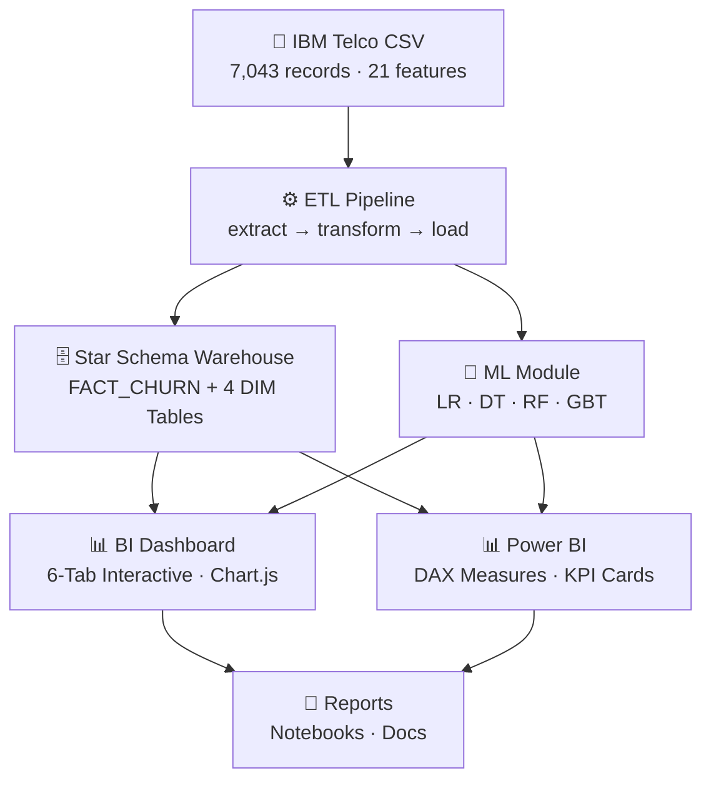
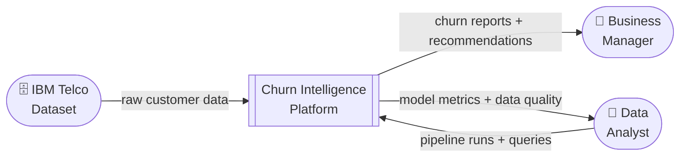
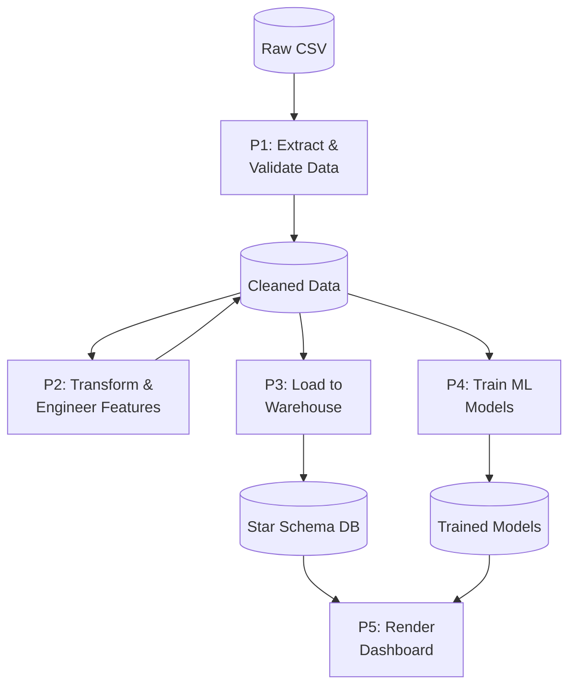
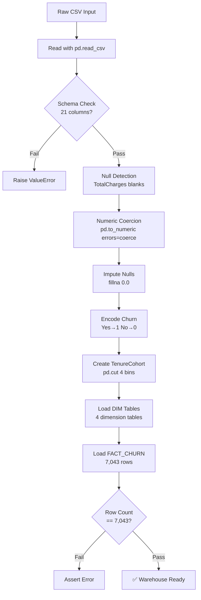
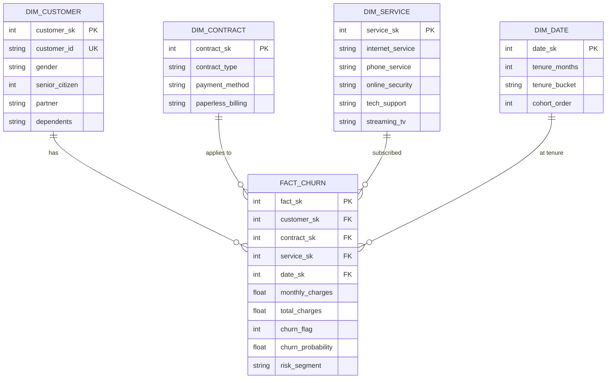
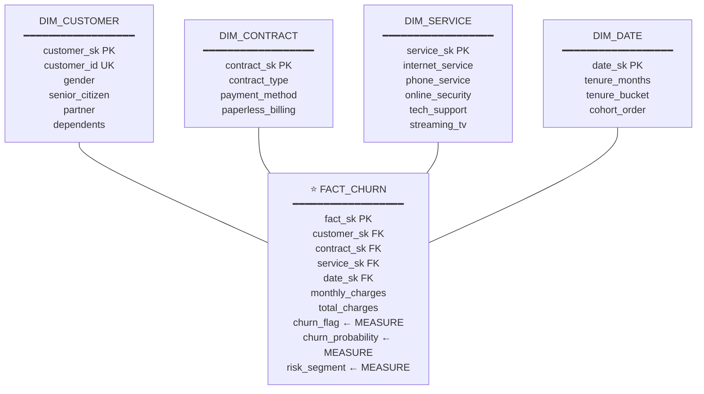
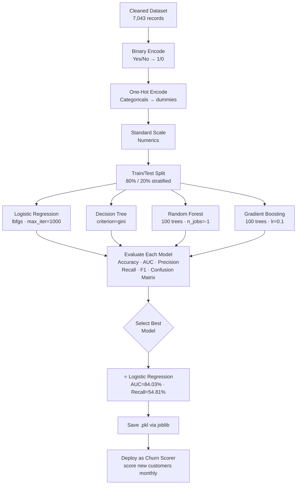
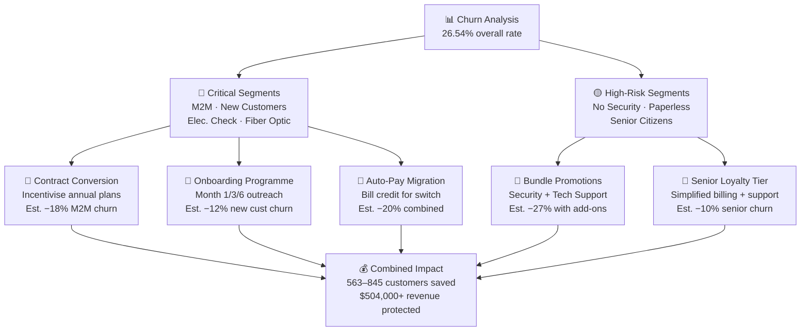

# 📐 System Diagrams
## Telecom Customer Churn Intelligence Dashboard

All diagrams are written in **Mermaid syntax** — render at [mermaid.live](https://mermaid.live) or in any Markdown viewer with Mermaid support (GitHub, VS Code, Notion).

---

## 1. High-Level Architecture

---

## 2. DFD Level 0 — Context Diagram

---

## 3. DFD Level 1 — Main Processes

---

## 4. DFD Level 2 — ETL Sub-Processes

---

## 5. Entity Relationship Diagram

---

## 6. Star Schema Diagram

---

## 7. ML Workflow

---

## 8. Retention Strategy Framework

