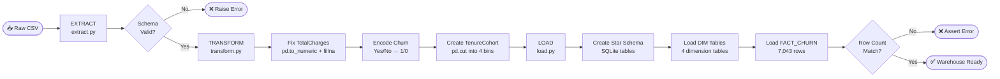

# ⚙️ ETL Workflow Documentation

---

## ETL Pipeline Overview



---

## Step-by-Step Breakdown

### Step 1: EXTRACT — `src/etl/extract.py`

| Sub-step | Action | Validation |
|----------|--------|-----------|
| 1.1 | `pd.read_csv(path)` | File exists check |
| 1.2 | Schema validation | All 21 expected columns present |
| 1.3 | Quality report | Count nulls, blanks, duplicates |
| 1.4 | Return raw DataFrame | Shape = (7043, 21) |

**Key outputs:**
- Raw DataFrame (7,043 × 21)
- Quality report logged to console

---

### Step 2: TRANSFORM — `src/etl/transform.py`

| Sub-step | Action | Before | After |
|----------|--------|--------|-------|
| 2.1 | Fix TotalCharges | String w/ 11 blanks | Float64, 0 nulls |
| 2.2 | Encode Churn | "Yes"/"No" string | 1/0 integer |
| 2.3 | Create TenureCohort | Not present | 4 cohort labels |
| 2.4 | Log churn rate | — | 26.54% confirmed |

**Imputation logic:**
```python
# TotalCharges: empty string → NaN → 0.0
# Rationale: tenure=0 customers have $0 total billing (new subscribers)
df['TotalCharges'] = pd.to_numeric(df['TotalCharges'], errors='coerce')
df['TotalCharges'].fillna(0.0, inplace=True)
```

**Tenure cohort boundaries:**
```
0  ──── 12 mo  → "0-12 mo"   (New Customers)
13 ──── 24 mo  → "13-24 mo"  (Early Customers)
25 ──── 48 mo  → "25-48 mo"  (Established)
49 ──── 72 mo  → "49-72 mo"  (Long-term / Loyal)
```

---

### Step 3: LOAD — `src/etl/load.py`

| Sub-step | Action | Rows |
|----------|--------|------|
| 3.1 | CREATE TABLE statements (5 tables) | — |
| 3.2 | Load DIM_CUSTOMER | 7,043 unique customers |
| 3.3 | Load DIM_CONTRACT | 12 distinct contract combinations |
| 3.4 | Load DIM_SERVICE | 27 distinct service combinations |
| 3.5 | Load DIM_DATE | 4 tenure buckets |
| 3.6 | Load FACT_CHURN | 7,043 fact rows |
| 3.7 | Validate row count | assert count == 7,043 |

---

## Data Quality Checklist

| Check | Expected | Result | Status |
|-------|----------|--------|--------|
| Row count preserved | 7,043 | 7,043 | ✅ PASS |
| TotalCharges nulls (post) | 0 | 0 | ✅ PASS |
| TotalCharges type | Float64 | Float64 | ✅ PASS |
| Churn encoding | 0/1 | 0/1 | ✅ PASS |
| TenureCohort created | Yes | Yes | ✅ PASS |
| Duplicate rows | 0 | 0 | ✅ PASS |
| Warehouse FK integrity | Valid | Valid | ✅ PASS |

---

## Running the ETL Pipeline

```bash
# Full pipeline (ETL + ML + charts)
python main.py

# ETL only (Python module)
python -c "
from src.utils.config import Config
from src.etl.extract import DataExtractor
from src.etl.transform import DataTransformer
from src.etl.load import DataLoader

cfg = Config(); cfg.ensure_dirs()
df = DataExtractor(cfg.RAW_DATA_PATH).load()
df = DataTransformer(df).run()
DataLoader(df, cfg.DB_PATH).run()
print('ETL complete')
"
```

---

## Error Handling

| Error Type | Source | Handling |
|-----------|--------|---------|
| `FileNotFoundError` | CSV not found | Raised with descriptive message |
| `ValueError` | Missing columns | Lists all missing column names |
| `AssertionError` | Row count mismatch | Reports expected vs actual count |
| `sqlite3.OperationalError` | DB lock or disk full | Propagated with context |
