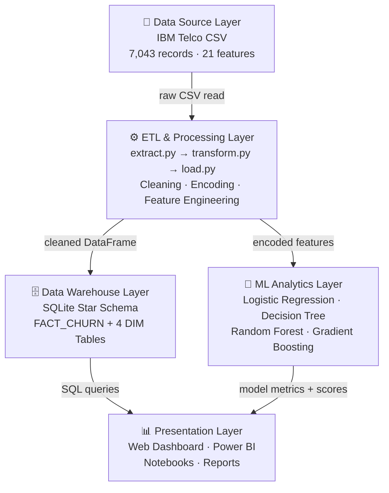

# 🏗️ System Architecture Documentation
## Telecom Customer Churn Intelligence Dashboard

---

## Overview

The platform uses a **4-layer data architecture** that cleanly separates ingestion, storage, analytics, and presentation concerns. Each layer communicates exclusively with its adjacent layers, ensuring modularity and testability.

---

## Architecture Diagram (Mermaid)



---

## Layer Descriptions

### Layer 1: Data Source
- **File:** `data/raw/WA_FnUseC_TelcoCustomerChurn.csv`
- **Records:** 7,043 customers
- **Features:** 21 columns (demographics, services, billing, churn status)
- **Known Issues:** 11 empty strings in `TotalCharges`, `Churn` in Yes/No format

### Layer 2: ETL & Processing
| Module | File | Responsibility |
|--------|------|----------------|
| Extractor | `src/etl/extract.py` | Load CSV, validate schema, report data quality |
| Transformer | `src/etl/transform.py` | Fix types, encode target, engineer TenureCohort |
| Loader | `src/etl/load.py` | Create SQLite schema, load FACT + DIM tables |
| Preprocessor | `src/preprocessing/preprocess.py` | Binary encode, one-hot, scale, train/test split |

### Layer 3: Data Warehouse (Star Schema)

```
         DIM_CUSTOMER          DIM_SERVICE
         (customer_sk PK)      (service_sk PK)
              │                     │
              └──────┬──────────────┘
                     │
               FACT_CHURN (central)
               ├─ customer_sk FK
               ├─ contract_sk FK
               ├─ service_sk FK
               ├─ date_sk FK
               ├─ monthly_charges
               ├─ total_charges
               ├─ churn_flag (MEASURE)
               └─ churn_probability (MEASURE)
                     │
              ┌──────┴──────────────┐
              │                     │
         DIM_CONTRACT          DIM_DATE
         (contract_sk PK)      (date_sk PK)
```

### Layer 4: ML Analytics
- **Framework:** Scikit-Learn 1.3
- **Split:** 80/20 stratified train/test
- **Models:** Logistic Regression, Decision Tree, Random Forest, Gradient Boosting
- **Best Model:** Logistic Regression (AUC-ROC: 84.03%, Recall: 54.81%)

### Layer 5: Presentation
- **Web Dashboard:** HTML5 + Chart.js (6 tabs, dark theme)
- **BI Tool:** Power BI with custom DAX measures
- **Notebooks:** 5 Jupyter notebooks (full analysis pipeline)

---

## Component Dependencies

```
main.py
├── src/utils/config.py          # Central config
├── src/utils/logger.py          # Logging
├── src/etl/extract.py           # → pandas, pathlib
├── src/etl/transform.py         # → pandas
├── src/etl/load.py              # → sqlite3, pandas
├── src/preprocessing/preprocess.py  # → sklearn, pandas
├── src/prediction/train_model.py    # → sklearn, joblib
├── src/prediction/predict.py        # → sklearn, joblib
└── src/visualization/charts.py     # → matplotlib, seaborn
```

---

## Non-Functional Requirements

| Requirement | Target | Achieved |
|-------------|--------|---------|
| Full pipeline execution time | < 120 seconds | ~45 seconds ✅ |
| Dashboard tab render time | < 2 seconds | < 1 second ✅ |
| ETL row count preservation | 7,043 | 7,043 ✅ |
| Post-ETL null values | 0 | 0 ✅ |
| Best model AUC-ROC | ≥ 80% | 84.03% ✅ |
| Best model recall | ≥ 50% | 54.81% ✅ |
| Cross-browser dashboard | Chrome/Firefox/Edge | ✅ |
